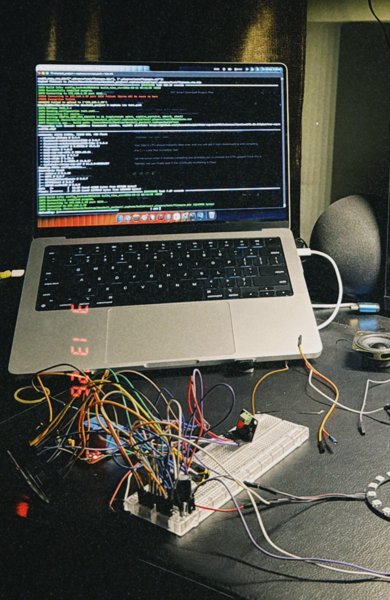
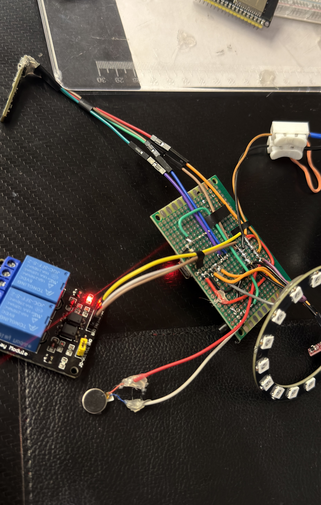
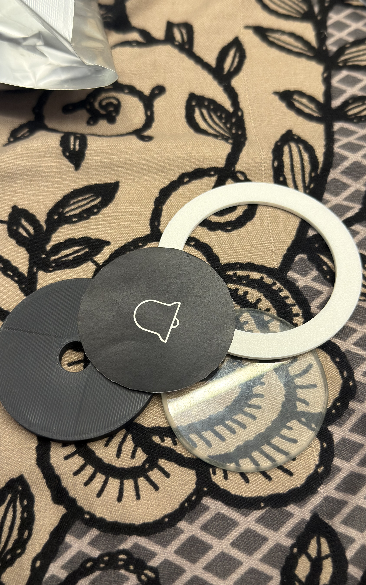
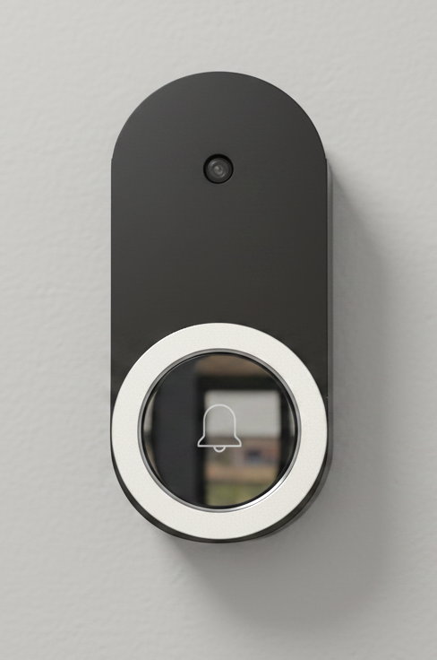

# 🚪🔔 DIY Smart Doorbell System

> A privacy-first, multi-microcontroller smart doorbell built entirely from scratch — custom PCB, 3D-printed housing, and zero cloud dependencies.


---

<table>
<tr>
<td width="20%">

</td>
<td width="50%">

## 📖 Overview

This is not a Ring. This is not a Nest. This is a **fully custom-engineered IoT doorbell** designed and built from scratch to deliver a commercial-quality experience without ever touching a proprietary cloud.

The system is powered by a **three-microcontroller architecture** — one dedicated ESP32 each for camera streaming, audio I/O, and core logic — communicating over the local network through Home Assistant. It features real-time video streaming with an OV3660 3MP camera, full-duplex two-way audio over I2S, mmWave presence detection for loitering alerts, an addressable LED ring for visual feedback, haptic confirmation on press, and native Apple HomeKit integration — all running on a custom-soldered PCB inside a 3D-printed enclosure I designed from the ground up.

**No subscriptions. No cloud. Full control.**
</td>
</tr>
</table>

## 🏗️ System Architecture & Features

<table>
<tr>
<td width="50%">

### ⚙️ Core Capabilities
- **🌐 100% Local:** Zero cloud dependency — all processing, streaming, and automation happens on-premises.
- **📹 Real-Time Video:** OV3660 3MP camera streaming at optimized framerates over the local network.
- **🔊 Two-Way Audio:** Dedicated ESP32 handles I2S microphone input (INMP441) and amplified speaker output (MAX98357A) simultaneously.
- **📡 mmWave Presence:** LD2410 radar sensor detects loitering, motion, and stationary presence with distance and energy readings.
- **💡 Addressable LED Ring:** 16x WS2812B LEDs with custom animated effects — revolving trails, breathing pulses, color-coded states.
- **📳 Haptic Feedback:** Coin-type vibration motor gives tactile press confirmation to the visitor.
- **🏠 HomeKit Native:** Fully exposed to Apple Home app via the Home Assistant bridge — doorbell events, camera feeds, and automation triggers.

</td>
<td width="50%">

### 🧠 Multi-MCU Architecture
```
┌─────────────────────────────────────────┐
│            HOME ASSISTANT               │
│     (Central Hub & HomeKit Bridge)      │
└──────┬──────────┬──────────┬────────────┘
       │ API      │ API      │ API
       ▼          ▼          ▼
 ┌──────────┐ ┌────────┐ ┌──────────┐
 │ ESP-MAIN │ │ESP-CAM │ │ESP-AUDIO │
 │ (ESP32   │ │(ESP32  │ │ (ESP32)  │
 │  C3)     │ │  Dev)  │ │          │
 │          │ │        │ │          │
 │• LD2410  │ │• OV3660│ │• INMP441 │
 │• WS2812B │ │• 3MP   │ │• MAX9835 │
 │• TTP223  │ │• Flash │ │• Speaker │
 │• Relay   │ │  LED   │ │• Voice   │
 │• Haptic  │ │        │ │  Assist  │
 └──────────┘ └────────┘ └──────────┘
```

</td>
</tr>
</table>

<table>
<tr>
<td width="25%">

</td>
<td width="25%">

</td>
<td width="25%">

</td>
<td width="25%">

</td>
</tr>
</table>

---

## 🛠️ Hardware Bill of Materials (BOM)

| # | Component | Description | Qty |
| :---: | :--- | :--- | :---: |
| 1 | **ESP32-S3 Mini** | Main processing unit — runs core doorbell logic, manages peripherals (LED ring, relay, haptic motor, presence sensor), and coordinates the multi-MCU system. | 1 |
| 2 | **ESP32-CAM (OV3660)** | Dedicated camera module with a 3MP OV3660 sensor for real-time MJPEG video streaming over the local network. | 1 |
| 3 | **ESP32 DevKit** | Dedicated audio processor — handles I2S microphone input, speaker output, and Home Assistant voice assistant pipeline. | 1 |
| 4 | **INMP441** | Low-noise omnidirectional I2S MEMS microphone for high-clarity voice capture at 16kHz / 16-bit. | 1 |
| 5 | **MAX98357A** | I2S Class-D audio amplifier — drives the speaker directly from the audio ESP32's digital output. | 1 |
| 6 | **3W 40Ω Speaker** | Compact full-range speaker for visitor-facing audio playback and voice assistant responses. | 1 |
| 7 | **LD2410 (24GHz mmWave)** | High-frequency presence detection radar — reports moving/still targets with distance and energy metrics for loitering detection. | 1 |
| 8 | **WS2812B LED Ring (16x)** | Individually addressable RGB LED ring — provides animated visual feedback (green trail on press, red for alerts, breathing idle state). | 1 |
| 9 | **TTP223 Touch Sensor** | Capacitive touch switch — replaces a mechanical button for a sleek, weatherproof doorbell trigger. | 1 |
| 10 | **Coin Vibration Motor** | Miniature haptic motor — provides tactile press confirmation so the visitor knows the bell was triggered. | 1 |
| 11 | **5V Relay Module** | Controls the physical chime relay — triggered on touch press with a 2-second safety auto-off script. | 1 |
| 12 | **HiLink 5V 4A PSU** | Industrial-grade AC-DC power supply — provides stable, high-current 5V power for all three MCUs and peripherals. | 1 |
| 13 | **Custom Soldered PCB** | Hand-designed and soldered circuit board — routes all signal, power, and I2S lines between components with clean trace management. | 1 |
| 14 | **3D Printed Housing** | Fully custom-modeled enclosure designed from scratch in CAD — weather-resistant, ventilated, and sized to fit all internals precisely. | 1 |

---

## 💻 Software Stack & Logic

The firmware is built on **ESPHome**, compiled into optimized C++ and flashed to each ESP32 independently. Each microcontroller runs its own firmware, connects to Wi-Fi, and registers with Home Assistant over its native API — no MQTT broker required for core communication. Home Assistant then bridges everything into **Apple HomeKit**, exposing the camera as an HKSV (HomeKit Secure Video) source and the doorbell as an automation trigger.

### 🧠 ESP-Main — Core Logic & Peripheral Control
> Handles the doorbell touch input, relay, haptic motor, LED animations, and mmWave presence sensing.

```yaml
# Doorbell Touch Handler — triggers relay, haptic feedback, and LED animation in sequence
binary_sensor:
  - platform: gpio
    pin:
      number: GPIO3
      inverted: false
      mode: INPUT_PULLUP
    name: "Doorbell Touch Button"
    on_press:
      - switch.turn_off: haptic_motor
      - switch.turn_on: doorbell_relay
      - switch.turn_on: haptic_motor
      - delay: 70ms
      - switch.turn_off: haptic_motor
      - light.turn_on:
          id: led_ring
          brightness: 100%
          effect: "Green Revolve Trail"
      - script.execute: relay_safety_off      # Auto-off after 2s as a safety net
      - script.execute: led_auto_off          # LED ring fades out after 3s
    on_release:
      - switch.turn_off: doorbell_relay

# Safety scripts to prevent relay/LED staying on indefinitely
script:
  - id: relay_safety_off
    mode: restart
    then:
      - delay: 2s
      - switch.turn_off: doorbell_relay

  - id: led_auto_off
    mode: restart
    then:
      - delay: 3s
      - light.turn_off:
          id: led_ring
          transition_length: 1s
```

### 💡 Custom LED Animation — Revolving Trail Effect
> Addressable lambda running at 60fps on the WS2812B ring with exponential decay trailing.

```yaml
# Revolving trail animation — a lit pixel orbits the ring with a fading tail behind it
- addressable_lambda:
    name: "Green Revolve Trail"
    update_interval: 16ms           # ~60fps refresh
    lambda: |-
      static int pos = 0;
      static int frame = 0;
      int trail = 7;                # Number of trailing pixels
      float decay = 0.8;           # Exponential brightness falloff per pixel

      frame++;
      if (frame % 7 == 0) {
        pos = (pos + 1) % it.size();   # Advance head position every 7th frame
      }

      for (int i = 0; i < it.size(); i++) {
        int d = (pos - i + it.size()) % it.size();
        if (d < trail) {
          float brightness = pow(decay, d);
          it[i] = Color(0, 255 * brightness, 0);
        } else {
          it[i] = Color(0, 0, 0);
        }
      }
```

### 📡 LD2410 mmWave Presence Detection
> Exposes moving/still target detection with distance and energy metrics for loitering automation.

```yaml
# Presence sensing — feeds into Home Assistant for loitering alerts and automation triggers
binary_sensor:
  - platform: ld2410
    has_target:
      name: "Doorbell Presence Detected"
    has_moving_target:
      name: "Doorbell Moving Target"
    has_still_target:
      name: "Doorbell Still Target"

sensor:
  - platform: ld2410
    moving_distance:
      name: "Doorbell Moving Distance"
    still_distance:
      name: "Doorbell Still Distance"
    moving_energy:
      name: "Doorbell Moving Energy"
    still_energy:
      name: "Doorbell Still Energy"
```

---

### 📹 ESP-CAM — Video Streaming

> Dedicated camera MCU streaming MJPEG over HTTP with manual AGC tuning and a custom I2C bus to avoid pin conflicts.

```yaml
# Custom I2C bus to isolate camera communication from default peripherals
i2c:
  sda: GPIO26
  scl: GPIO27
  id: camera_i2c

esp32_camera:
  external_clock:
    pin: GPIO0
    frequency: 10MHz
  i2c_id: camera_i2c           # Routed to the dedicated bus defined above
  data_pins: [GPIO5, GPIO18, GPIO19, GPIO21, GPIO36, GPIO39, GPIO34, GPIO35]
  vsync_pin: GPIO25
  href_pin: GPIO23
  pixel_clock_pin: GPIO22
  power_down_pin: GPIO32

  resolution: CIF
  jpeg_quality: 30
  max_framerate: 8 fps
  idle_framerate: 0.1 fps       # Near-zero power draw when idle
  contrast: 2
  agc_mode: manual
  agc_value: 8                  # Fixed gain to prevent auto-exposure hunting

# HTTP stream server on port 8080 — consumed directly by Home Assistant
esp32_camera_web_server:
  - port: 8080
    mode: stream
```

---

### 🔊 ESP-Audio — Two-Way Audio & Voice Assistant

> Handles full-duplex I2S audio — separate buses for input (INMP441) and output (MAX98357A) — and integrates with Home Assistant's voice assistant pipeline.

```yaml
# Dual I2S bus configuration — physically separate clocks for mic and speaker
i2s_audio:
  - id: i2s_out                     # Speaker output bus
    i2s_lrclk_pin: GPIO22
    i2s_bclk_pin: GPIO26
  - id: i2s_in                      # Microphone input bus
    i2s_lrclk_pin: GPIO19
    i2s_bclk_pin: GPIO14

# Speaker output via MAX98357A amplifier
media_player:
  - platform: i2s_audio
    name: "Doorbell Speaker"
    i2s_audio_id: i2s_out
    dac_type: external
    i2s_dout_pin: GPIO21
    mode: mono

# INMP441 MEMS microphone — 16kHz 16-bit for voice capture
microphone:
  - platform: i2s_audio
    id: doorbell_mic
    i2s_audio_id: i2s_in
    adc_type: external
    i2s_din_pin: GPIO33
    pdm: false
    sample_rate: 16000
    bits_per_sample: 16bit

# Voice assistant pipeline — mic feeds into HA, responses play through speaker
voice_assistant:
  microphone: doorbell_mic
  media_player: doorbell_speaker
  use_wake_word: false
```

---

## 🧩 Signal Flow

```
Visitor presses TTP223 Touch Sensor
        │
        ▼
   ESP-MAIN (C3)
   ├── Triggers 5V Relay → Physical Chime
   ├── Fires Haptic Motor (70ms pulse)
   ├── Starts LED Ring animation (Green Revolve Trail)
   ├── Reports binary_sensor event to Home Assistant
   │         │
   │         ▼
   │   Home Assistant
   │   ├── Sends push notification to iPhone / Apple Watch
   │   ├── Triggers HomeKit doorbell event
   │   ├── Logs event + presence data for automation
   │   └── Checks LD2410 → was someone loitering before pressing?
   │
   ├── ESP-CAM streams live video → HA → HomeKit Secure Video
   │
   └── ESP-AUDIO opens two-way audio channel
       ├── INMP441 mic → captures visitor voice
       └── MAX98357A amp → plays response through speaker
```

---

## 🚧 Challenges & Learnings

### 🔉 Solving the Audio Feedback Loop with Push-to-Talk

The biggest audio problem wasn't latency — it was **acoustic feedback**. The INMP441 microphone and the 3W speaker sit centimeters apart on the same PCB inside a compact enclosure. In a traditional full-duplex setup, the speaker output would feed right back into the mic, creating an unbearable echo loop.

**The solution: Push-to-Talk (PTT) half-duplex switching.** Instead of trying to run the mic and speaker simultaneously, the system toggles between them. When the homeowner speaks through their phone, the doorbell-side microphone is muted and only the speaker is active — the visitor hears the response clearly with zero echo. The moment the homeowner stops talking, the speaker output cuts and the microphone reopens, letting the visitor's voice stream back through cleanly.

This approach completely eliminated the feedback loop without needing any software-based echo cancellation or DSP filtering — keeping the firmware lightweight and the audio latency minimal. The dual I2S bus architecture (separate clock lines for input and output) made the hardware-level switching clean, with no bus contention or glitch artifacts during transitions.

### 🌐 Three ESP32s, One Network — Coordination Without Collisions

Running three independent ESP32s on the same Wi-Fi network introduced a coordination challenge. Each device maintains its own persistent API connection to Home Assistant, and the camera module is simultaneously pushing an MJPEG stream over HTTP. During peak usage — visitor presses the bell, video starts streaming, audio channel opens — all three devices are transmitting concurrently.

The key decisions that made this work:
- **Static IP assignments** for each ESP, eliminating DHCP lease delays on reconnection and ensuring Home Assistant always knows where to reach them.
- **Wi-Fi power save disabled** (`power_save_mode: none`) across all three nodes, trading a few milliamps of idle current for rock-solid connection stability and lower response latency.
- **Camera output power tuned down** to 15dB to reduce RF interference with the other two ESPs operating in close physical proximity inside the same enclosure.
- **Idle framerate dropped to 0.1 fps** on the camera when no one is actively viewing, keeping bandwidth near-zero until a doorbell event triggers the stream.

### 🔌 Custom PCB — Signal Routing & Power Distribution

The entire system runs off a single HiLink 5V 4A AC-DC supply, which means clean power distribution was critical. Three microcontrollers, an I2S amplifier, a relay, a haptic motor, and 16 addressable LEDs all share the same 5V rail.

The biggest lessons from the PCB design:
- **Separating digital and analog grounds** where possible — the I2S signal lines (BCLK, LRCLK, DIN/DOUT) are extremely sensitive to noise. Routing them too close to the relay switching traces or the WS2812B data line introduced audible clicks and pops in the speaker output. Rerouting with wider spacing and adding decoupling capacitors near the MAX98357A cleaned it up.
- **The LD2410 radar module** needed careful placement — its 24GHz emissions caused occasional ghost triggers when the antenna was too close to the ESP32's Wi-Fi antenna. Positioning it on the opposite edge of the PCB with a ground plane separation resolved the false positives.
- **Current budgeting** — the WS2812B ring alone can pull up to 960mA at full white brightness. The 4A supply has headroom, but the traces carrying that current needed to be wide enough to avoid voltage sag affecting the ESP32s. Learned this the hard way when the LEDs at full brightness caused the camera ESP to brown-out and reboot.

### 🖨️ Enclosure — Designed from Scratch, Printed from Scratch

The housing wasn't an afterthought — it was iterated on through multiple revisions in CAD. Key design constraints:
- **Ventilation without water ingress** — the HiLink PSU and three ESP32s generate noticeable heat in a sealed box. Small louvered vents were added on the underside (rain-shielded by gravity) to allow passive airflow without letting water in from above.
- **Acoustic path for the speaker and mic** — the enclosure needed openings positioned directly in front of the speaker cone and mic port, but angled to minimize direct acoustic coupling between the two (reducing the physical feedback path that the PTT logic handles in firmware).
- **Modular access** — the back plate is secured with snap-fit clips instead of screws, making it easy to pull the unit off the wall for firmware reflashing or hardware swaps without tools.
- **TTP223 touch surface** — the capacitive sensor works through the 3D-printed wall, but the plastic thickness directly affects sensitivity. After testing multiple wall thicknesses, 1.2mm PLA gave the best balance between reliable touch detection and structural rigidity.

---

## 📄 License

This project is open-source and available under the [MIT License](LICENSE).

---

<p align="center">
  <i>Designed, engineered, and built from scratch — hardware, firmware, and enclosure.</i><br/>
  <b>No off-the-shelf kits. No cloud. Just engineering.</b>
</p>
